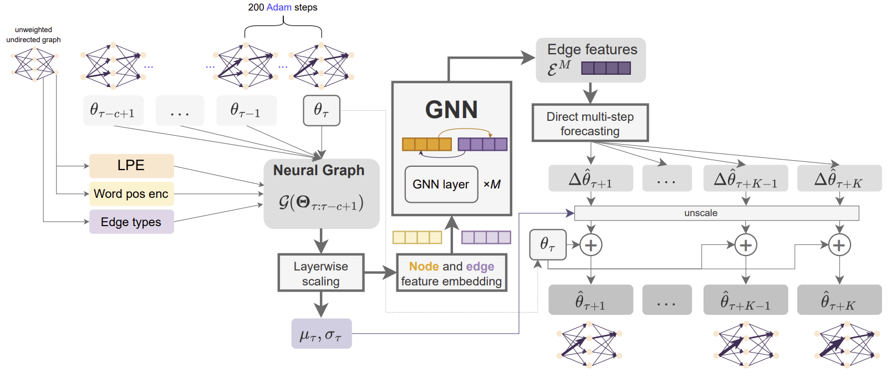
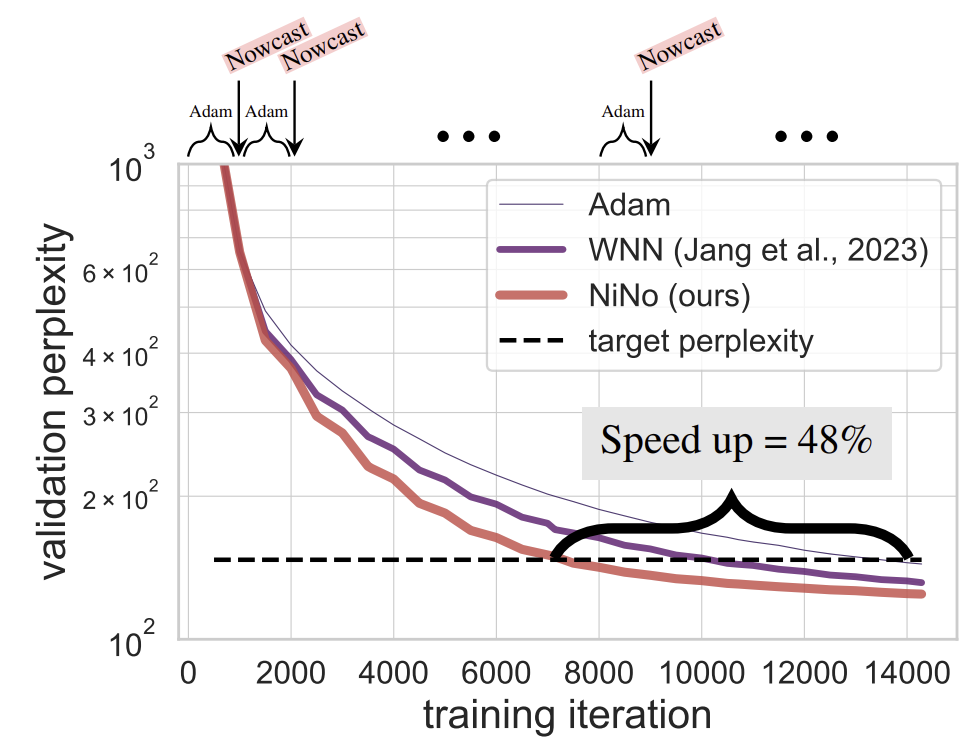

# Accelerating Training with Neuron Interaction and Nowcasting Networks

<pre>
<a href="https://arxiv.org/abs/2409.04434/">Accelerating Training with Neuron Interaction and Nowcasting Networks</a>
<a href="http://bknyaz.github.io/">Boris Knyazev</a>, <a href="https://amoudgl.github.io/">Abhinav Moudgil</a>, <a href="https://www.guillaumelajoie.com/">Guillaume Lajoie</a>, <a href="https://eugenium.github.io/">Eugene Belilovsky</a>, <a href="https://www.iro.umontreal.ca/~slacoste/">Simon Lacoste-Julien</a>

</pre>

**ICLR 2025 [`link to the slides and video presentation`](https://iclr.cc/virtual/2025/poster/29046)**

[](https://arxiv.org/abs/2409.04434), 
[openreview](https://openreview.net/forum?id=cUFIil6hEG), 
[marktechpost](https://www.marktechpost.com/2024/09/17/nino-a-novel-machine-learning-approach-to-accelerate-neural-network-training-through-neuron-interaction-and-nowcasting/)


# Intro

**Neuron interaction and Nowcasting (NiNo) model** 

We introduce the NiNo model predicting future (nowcasting) parameters by learning neuron interaction 
in vision and language tasks. 
We feed c (c=5 by default) past parameter states as input to NiNo and 
nowcast K states leveraging [neural graph structure](https://github.com/mkofinas/neural-graphs) and graph neural networks.
For a new optimization task, NiNo is applied rarely over time: only once per 1k steps of Adam 
(or another base optimizer).
<figure> </figure>

**Using NiNo with Adam**

Adam without and with nowcasting using our NiNo model on a language task that NiNo has not seen during its training.
<figure> </figure>


# Requirements

The experiments from our paper can be run using a single GPU with <= 80GB of memory.

- python >= 3.8
- pytorch >= 2.0
- torch_geometric
- transformers
- datasets
- other optional dependencies (networkx, pydot)

# Updates

- [x] Initial code release with a pretrained NiNo model (see the [`checkpoints`](checkpoints) folder).
- [x] Neural graphs and evaluation script for convnet tasks.
- [x] Neural graphs and evaluation script for transformer tasks:
  - [x] GPT2
  - [x] Llama (experimental code, see a graph for a smaller variant of `meta-llama/Meta-Llama-3.1-8B` in the [`results`](results) folder)
  - [x] BERT (experimental code, *not part of the paper*)
  - [x] Vision Transformer (experimental code, *not part of the paper*)
  - [x] &#128293; **Mar 12, 2025**: [NanoGPT](https://github.com/KellerJordan/modded-nanogpt) (experimental code, *not part of the paper*, see [`results`](results), [`graph/graph_nanogpt.py`](graph/graph_nanogpt.py) and my fork https://github.com/bknyaz/modded-nanogpt)
- [x] Code for a NiNo step in a separate process (with an example for Llama3).
  - &#128293; **Dec 10, 2024**: efficient inference with `--subgraph` and `--edge_sample_ratio 0.05`
  allowing the NiNo step for **Llama3.2-1B** to be done on a single GPU.
- [x] Training dataset and training code for NiNo. 
  - **Nov 22, 2024**: the code update is important to reproduce training of the NiNo model.

# Pretrained NiNo models

We provide the checkpoint for our best performing NiNo model at `checkpoints/nino.pt` as well as other models:
- [x] `nino.pt` - default NiNo model (assume the GPT2 tokenizer)
- [x] `nino_no_posw.pt` - NiNo without positional encoding for word embeddings (can be used for arbitrary models and tokenizers including Llama)
- [x] `nino_h32.pt` - NiNo with hidden size 32 instead of default 128
- [x] `nino_mlp.pt` - WNN+ model (does not use graphs)
- [x] `nino_mlp_h32.pt` - WNN+ model (does not use graphs), with hidden size 32 instead of default 128
- [x] `nino_towers4.pt` - NiNo with 4 towers in the message passing step for better efficiency (*not part of the paper*)
 
# Using pretrained NiNo models

## Minimal example

Training loop with NiNo for some language model:

```python
import torch
import torch.nn.functional as F
from transformers import AutoModelForCausalLM
from optim import NiNo

model = AutoModelForCausalLM.from_config(...)  # some model

# NiNo is implemented as a wrapper around the base optimizer
# any optimizer other than Adam should also be possible to use with NiNo
opt = NiNo(base_opt=torch.optim.AdamW(model.parameters(), lr=1e-3, weight_decay=1e-2),
           ckpt='checkpoints/nino.pt',
           subgraph=False, # can be set to True for larger models (see Llama 3.2 example below)
           edge_sample_ratio=0,  # can be set to a small number for larger models (see Llama 3.2 example below)
           model=model,
           period=1000,
           max_train_steps=10000)
for step in range(10000):
    if opt.need_grads:  # True/False based on the step number and period
        opt.zero_grad()  # zero out gradients
        data, targets = ...  # get some batch of data
        # base optimizer step (majority of the time)
        outputs = model(data)  # forward pass
        loss = F.cross_entropy(outputs, targets)  # compute some loss
        loss.backward()  # only compute gradients for the base optimizer            
    opt.step()  # base_opt step or nowcast params every 1000 steps using NiNo    
    ...
```

## Reproducing the results from our paper

### Vision tasks

Evaluate on all vision tasks:
```commandline
for task in FM-16 C10-16 FM-32 C10-32 C100-32;
do for seed in $(seq 1000 1000 10000); 
do python train_vision.py --task $task --seed $seed --nino_ckpt checkpoints/nino.pt | tee -a results.log; done; done
```

To evaluate without the NiNo model, run with `--nino_ckpt none`.
You should get the results similar Table 1 and 2 in the paper.

Use `--verbose 1` for more detailed output and `--verbose 2` for graph visualizations (saved in `./results/`).

### Language tasks

Single seed training on the Wiki/3-64 task:

```commandline
python train_lm.py --dataset_name wikitext --dataset_config_name wikitext-103-raw-v1 \
--num_train_epochs 4 --layers 3 --dim 64 --heads 4 --nino_ckpt checkpoints/nino.pt
```

For LM1B tasks, use `--dataset_name lm1b --dataset_config_name plain_text`.

### NiNo step in a separate process (for larger models)

#### Llama 3-tiny (111M params)

Training a `LLama3`-based model on `wikitext-103-raw-v1` for 15k steps with NiNo applied every 1k steps:

```commandline
for s in $(seq 1000 1000 15000); 
do 
python train_lm.py --dataset_name wikitext --dataset_config_name wikitext-103-raw-v1 --num_train_epochs 4 --cache_dir $HF_HOME \
 --layers 6 --dim 384 --heads 6 --heads_key_value 2 --tokenizer_name meta-llama/Meta-Llama-3.1-8B --hf_login $HUGGING_FACE_TOKEN \
 --output_dir $CHECKPOINTS --checkpointing_steps 200 --max_train_steps $s --resume_from_checkpoint $CHECKPOINTS/step_$((s-1000)) \
 --target 20 --per_device_eval_batch_size 8; 
 python nino_step.py --ckpt_path $CHECKPOINTS/step_$s --save_path $CHECKPOINTS/step_$s  --verbose 1 --period 1000 \
 --max_train_steps 15000 --nino_ckpt checkpoints/nino_no_posw.pt --hf_login $HUGGING_FACE_TOKEN --edge_sample_ratio 0.05;
done
```

where `$HUGGING_FACE_TOKEN` is your [Hugging Face token](https://huggingface.co/docs/huggingface_hub/en/quick-start#authentication), 
`$HF_HOME` is the cache directory for the dataset (optional),
and `$CHECKPOINTS` is the directory to save the model checkpoints.


Using `--edge_sample_ratio 0.05` allows to apply NiNo in this configuration on a single GPU with 80GB of memory.
Even though we sample 5% edges in the message passing step, 
we were able to achieve the perplexity of `24.17±0.08` after 10k steps and `22.29±0.13` after 14k steps 
(average and std for 3 seeds), which is very similar to the results in our paper (Table 4).

#### &#128293; Llama 3.2 (1B params)

Same pipeline as above, but in addition we use `--subgraph` that decomposes the Llama model into subgraphs 
corresponding to transformer blocks and applies NiNo to each subgraph independently. 
This allows to reduce the memory consumption significantly and apply NiNo to larger models on a single GPU.

```commandline
for s in $(seq 1000 1000 15000); 
do 
python train_lm.py --dataset_name wikitext --dataset_config_name wikitext-103-raw-v1 --num_train_epochs 4 --cache_dir $HF_HOME \
 --config_name meta-llama/Llama-3.2-1B --tokenizer_name meta-llama/Llama-3.2-1B --hf_login $HUGGING_FACE_TOKEN \
  --output_dir $CHECKPOINTS --checkpointing_steps 200 --max_train_steps $s --resume_from_checkpoint $CHECKPOINTS/step_$((s-1000)) \
  --target 10 --per_device_train_batch_size 8 --per_device_eval_batch_size 2 --gradient_accumulation_steps 4; 
  python nino_step.py --ckpt_path $CHECKPOINTS/step_$s --save_path $CHECKPOINTS/step_$s  --verbose 1 --period 1000 \
 --max_train_steps 15000 --nino_ckpt checkpoints/nino_no_posw.pt --hf_login $HUGGING_FACE_TOKEN --subgraph --edge_sample_ratio 0.05;
 done 
```

where `--gradient_accumulation_steps 4` is used to keep the same batch size of 32 on a single GPU with 80GB of memory.
Despite a more efficient implementation, some steps such as projecting the features of the `embed_tokens` layer
are still expensive and have to be moved to CPU, 
which requires ~300GB of RAM. We are looking forward to further improvements in the future.

# Training NiNo

1. Download the training dataset of checkpoints (~200GB of disk space) from https://huggingface.co/datasets/SamsungSAILMontreal/nino_metatrain (`--revision mmap`):
```commandline
export HF_HOME=/path/to/hf_cache;  # huggingface home directory (where the dataset will be downloaded) 
./dataset/download.sh $HF_HOME
```
2. Train the NiNo model and save it to ./checkpoints/nino_seed0.pt: ```python train_nino.py --wte_pos_enc```

   - Note 1: If you are planning to use the trained NiNo model on LLM architectures with a non-GPT2 vocabulary, train it without `--wte_pos_enc`
   - Note 2: We use a high learning rate (0.003) by default that shows better performance, 
      but it leads to a NaN loss sometimes, especially if amp is used, so as a workaround we train NiNo in a loop 
      (NiNo checkpoints are automatically saved every 200 steps, so it is resumed from the last checkpoint): 
      ```for i in $(seq 1 50); do python train_nino.py --wte_pos_enc; done```. 
      Although training without amp (by using `--no_amp`) also avoids this problem, 
      we noticed that the training loss overfits in that case, 
      so some hyperparameter tuning might be needed.


# Contributing

Pull requests and github issues are welcome. For major changes, please open an issue first to discuss what you would like to change.

# LICENSE

MIT, see the [LICENSE](LICENSE) file.


# Citation

```
@inproceedings{knyazev2024accelerating,
  title={Accelerating Training with Neuron Interaction and Nowcasting Networks}, 
  author={Boris Knyazev and Abhinav Moudgil and Guillaume Lajoie and Eugene Belilovsky and Simon Lacoste-Julien},  
  booktitle={International Conference on Learning Representations},
  year={2025},
}
```
